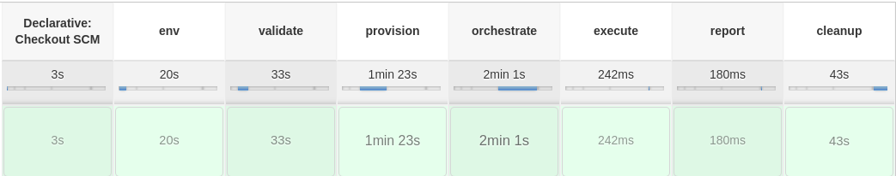

junit-example
=============

This repository demonstrates how teflo can install junit framework on test
machines and execute tests. Teflo is the conductor which glues all the pieces
together. In this example junit is installed from an ansible role
(junit-install). The role also configures the necessary environment variables
needed when running the tests. Prior to installing junit it will provision the
2 test machines and register the necessary ones with red hat subscription
manager.

The scenario descriptor (scenario.yml) describes the entire end to end workflow
for this scenario. There you will be able to see exactly what will be performed.

The ansible directory contains all playbooks, roles, etc to be consumed by
the scenario.

The jenkins directory contains all necessary files for running this scenario
from jenkins. It also includes a script to deploy a jenkins job within your
jenkins server. Please note some modification to the files is required.

The keys directory is where you can store any SSH keys used during teflos
orchestrate task to connect to remote machines.

The ansible.cfg is scenario defined configuration for ansible which teflo
consumes.

The teflo.cfg is how the scenario configures teflo.

The roles.yml file defines all roles the scenario requires. Teflo will
consume this role and download them at runtime to use. This eliminates the
need to fork an external role into the scenario repository.

----

How to run
----------

Below you will find two sections showing how you can run this scenario.

Jenkins Job
~~~~~~~~~~~

Within this repository there is a jenkins directory. Inside the directory
contains all the necessary files to build a jenkins job using jenkins job
builder against a targeted jenkins server. Below are the list of steps
demonstrating how to build the job to your targeted jenkins server.

.. code-block:: bash

    # first set your jenkins server authentication details
    $ vim jenkins/build/auth.ini

    # call the target to build the customer use case job
    $ make build-jenkins-job

Once the job is successfully built, you can start the jenkins job from your
jenkins server (GUI), jenkins api, etc. Please review the jobs build parameters
for controlling how you can pass data to teflo. The following build parameters
are the ones that need attention before running:

#. AGENT
#. TEFLO_SETTINGS
#. SSH_KEYS_DIR
#. OS_NETWORK
#. OS_FLOATING_IP_POOL
#. OS_KEYPAIR

Command Line
~~~~~~~~~~~~

Below are a list of steps demonstrating how to run the scenario by teflo.

.. code-block:: bash

    # create a python virtual environment
    $ virtualenv --system-site-packages teflo
    $ source teflo/bin/activate

    # install teflo
    (teflo) $ pip install teflo

    # tell teflo where your teflo.cfg is (if outside this repository)
    (teflo) $ export TEFLO_SETTINGS=~/secret/teflo.cfg

    # tell teflo about additional data to be substituted into the scenario
    # descriptor
    (teflo) $ export OS_NETWORK="network_name"
    (teflo) $ export OS_FLOATING_IP_POOL="10.8.240.0"
    (teflo) $ export OS_KEYPAIR="keypair"

    # copy the SSH private key for connection to machines into keys directory
    (teflo) $ cp /path/to/keys/* ./keys

    # call teflo to run the scenario against the test machine
    (teflo) $ teflo run -s scenario.yml -w . -d .teflo --log-level info

----

Please visit the following link below for more details on teflo.

https://teflo.readthedocs.io/en/latest/